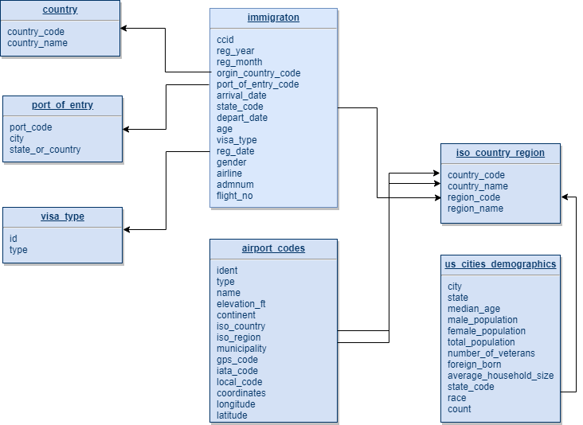
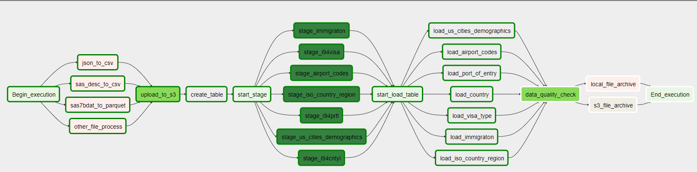
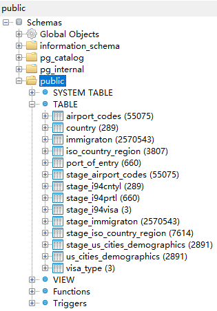

## 项目概述
某个组织想对美国的旅游数据、各州人种分布等进行数据可视化和分析，希望我构造一个数据平台，方便他们进行后续的查询与分析。我利用习得的数据工程知识，为他们构造了数据管道。
## 项目范围和目标
- 将来源不一，格式不一的原始数据（生数据），集中存储到数据仓库中
- 进行初步清洗加工，构造易于理解的数据模型
- 历史数据归档 
- 最终存放在数据仓库中的数据，能用于以下分析和展现：
    - 人们都喜欢去美国的哪些州旅游？
    - 去美国的人中，办哪种签证的人最多？
    - 美国人种组成
    - 旅游人群年龄分布
    - 各国机场规模构成
    - 其他可能进行的分析……

## 数据源
- I94移民数据，来自美国国家旅游和贸易办公室，可在[这里](https://travel.trade.gov/research/reports/i94/historical/2016.html)找到，包括签证类型、交通方式、年龄段等数据。格式为sas7bdat，并附带SAS数据字典文件，内含标签数据解释；
- 机场编码数据，数据来源于[DataHub](https://datahub.io/core/airport-codes#data)，包含机场规模、所属国家和地区，经纬度等信息。格式为CSV；
- 美国城市人口数据，来源于[OpenDataSoft](https://public.opendatasoft.com/explore/dataset/us-cities-demographics/export/)，格式为CSV；
- 国家与地区ISO代码（iso-3166-2），数据来源于[GitHub](https://github.com/olahol/iso-3166-2.json/blob/master/iso-3166-2.json)，格式为JSON。

## 数据清洗与转换
### 主要清洗和转换工作
- sas7bdat原始数据量比较大，选择用PySpark读取后转为Parquet格式，然后上传到S3，最后加载到Redshift中，这样可以充分利用Parquet自动分区和压缩的特性，加快加载速度；
- 对SAS数据字典文件进行解析，提取i94国家、签证类型、入境港的代码与名称Mapping关系，保存为csv;
- 将JSON格式的iso-3166-2解析转换为更加平面化的csv，便于后续加载到数据库。
### 数据模型

## 数据管道
主要步骤如下：
- 需要入仓的数据放入input目录
- 对input目录中的文件其进行解析，转换成规整的CSV或Parquet格式，保存到upload目录
- 将upload目录中的文件上传到S3
- 用copy命令将S3中文件加载到Redshift，保存为Stage表
- 用SQL将Stage表中数据加载到维表和事实表，并进行基本的数据质量检测
- 对本地input目录和S3上文件，进行归档操作 

用Airflow将以上ETL步骤自动化，DAG图如下：

最后加载到Redshift的数据表如下：

## 运行步骤
- 安装python、spark、airflow、boto3
- 创建AWS账号
- 创建Redshift集群、S3存储桶
- 配置Redshift允许外网连接，Redshift的用户可访问S3（可以运行aws目录下的脚本）
- 配置airflow变量（stage_bucket、data-upload、data-input、bucket_region、data-input-archive）和连接（redshift_dend、aws_credentials_dend）
- 将airflow下的dags和plugins放入$AIRFLOW_HOME目录下
- 将数据源数据放入设置的data-input目录下
- 运行Airflow，打开Airflow Web管理界面，Trigger the DAG

## 未来场景与扩展措施
- 若数据量增长100倍
    - 提高Redshift集群的配置，增加Redshift的节点数
    - 用AWS的EMR服务以提升Spark的处理能力
    - 将Airflow配置为集群模式
- 若数据管道需要每天早上7点进行 
    - 只需要在Airflow中配置任务开始时间和间隔即可
- 若数据库需要被100人以上的用户访问
    - 合理对表设置分区键、排序键、分配模式，提升查询性能
    - Redshift本身就是分布式的MPP数据库，架构上不用做太大改变