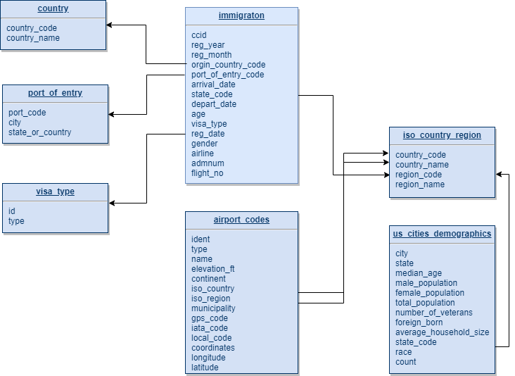

## Project Summary
An organization wants to visualize and analyze the tourism data and the distribution of people in different states in the United States. It hopes that I can construct a data platform to facilitate their follow-up query and analysis.I used my acquired knowledge of data engineering to build data pipelines for them.

## Scope And Golas
- gather raw data in various formats from different source into data warehouse
- build data model easy to understand
- the final data should contains information able to answer the following questions for example：
    - which states in the United States do people like to visit?
    - which type of visa does most people have among the visitors?
    - the proportion of different race in each state
    - the age distribution of the visitors

## Data Source
- **I94 Immigration Data**:This data comes from the US National Tourism and Trade Office found [here](https://travel.trade.gov/research/reports/i94/historical/2016.html),each report contains international visitor arrival statistics by world regions and select countries, type of visa, mode of transportation, age groups, states visited, and the top ports of entry.Data format is sas7bdat,along with a data dictionary file.

- **Airport Code**:It comes from [DataHub](https://datahub.io/core/airport-codes#data),including airport scale,country and state codes and so on,in csv format.

- **U.S. City Demographic Data**:It comes from [OpenDataSoft](https://public.opendatasoft.com/explore/dataset/us-cities-demographics/export/)，in csv format;

- **Country and Subdivision ISO code(iso-3166-2)**:it comes from [GitHub](https://github.com/olahol/iso-3166-2.json/blob/master/iso-3166-2.json),in json format.

## ETL and Data Pipeline
###  data clean  
- the sas7bdat original data is so large，so i use PySpark to transfer it to parquet file,then upload to s3,copy to Redshift.
- parse then SAS data dictionary,extract the code and name mapping relationship of i94 country, visa type, port of entry, and saved it as csv.
- transfer the json-formatted iso-3166-2 data to a more flat csv file for later loading into the database.
### data model

### Data Pieline
The main steps are as follows:
- put the raw data into the input directory
- parsed the file in the input directory, converted it into a clean csv or parquet format, and saved it into the upload directory
- upload the files in the upload directory to S3
- load S3 files into Redshift with copy command and save them as stage table
- load the data in the stage table into the dimension table and fact table with SQL, and perform basic data quality inspection
- archive the files in local input directory and files on S3

use Airflow to automate the steps above,the DAG is as follows:

after running ETL process,the tables in the database: 

## How to Run
- install python, spark, airflow, boto3
- create an AWS account
- create Redshift cluster and S3 buckets
- configure Redshift to allow external network connections, and users of Redshift can access S3
- configure Airflow variables (stage_bucket, data upload, data input, bucket_region, data - input - archive) and connections (redshift_dend, aws_credentials_dend)
- Put dags and plugins under $AIRFLOW_HOME directory
- put the raw data into the data-input directory
- start the Airflow, opened the Airflow web page,trigger the DAG

## Future Scenarios
- The data was increased by 100x
    - improve the configuration of Redshift cluster and increase the number of nodes of Redshift cluster
    - use AWS EMR services to enhance Spark's processing power
    - deploy Airflow to cluster mode,using Celery Executor or Dask Executor
- if the data pipeline needs to run at 7 am every day
    - just set the start time and intervals of tasks in airflow dags definition
- if the database needs to be accessed by more than 100 users
    - reasonably set partitioning key, sorting key and distribution styles for the tables in Redshift to improve query performance
    - Redshift itself is a distributed MPP database,no need to change architecture